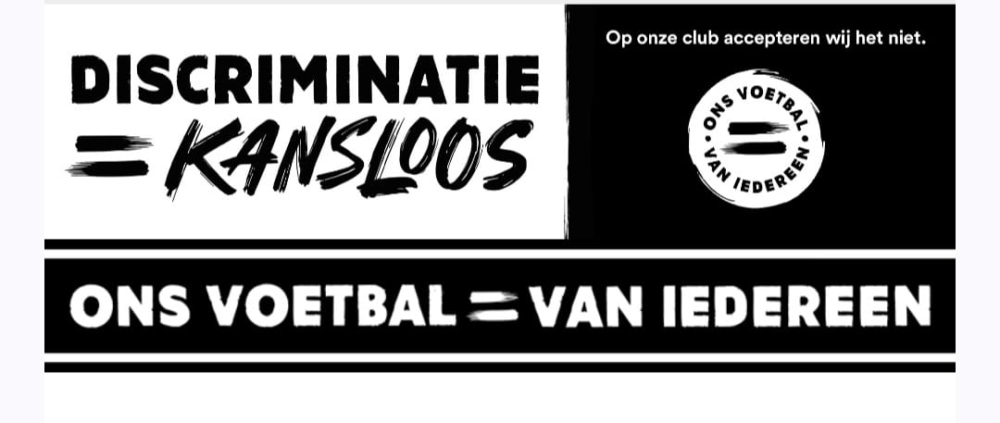

# Soccer/Football Web Application (SFWA)

<p align="center">
    
</p>

## About SFWA

SFWA is a comprehensive web application for managing soccer/football leagues, teams, and matches. Built with Laravel and Livewire, it provides a modern and interactive platform for football administration and fan engagement.

## Features

- **Club Management**
  - Add and manage football clubs
  - Upload and manage club logos
  - Track club information and statistics

- **Player Management**
  - Player profiles and statistics
  - Goal scoring records
  - Player performance tracking

- **Match Management**
  - Fixture creation and scheduling
  - Live score updates
  - Match statistics and reports
  - Stadium information

- **League Management**
  - Automated standings table
  - Points calculation
  - League statistics

- **User Management**
  - Admin and user roles
  - Authentication system
  - Profile management
  - Privacy policy implementation

## Technology Stack

- **Backend:** Laravel 10.x
- **Frontend:**
  - Livewire
  - Tailwind CSS
  - Alpine.js
- **Database:** MySQL
- **Authentication:** Laravel Breeze

## Requirements

- PHP >= 8.1
- Composer
- Node.js & NPM
- MySQL

## Installation

1. Clone the repository:
```bash
git clone https://github.com/nahom17/SEFWA.git
```

2. Install PHP dependencies:
```bash
composer install
```

3. Install NPM dependencies:
```bash
npm install
```

4. Create environment file:
```bash
cp .env.example .env
```

5. Generate application key:
```bash
php artisan key:generate
```

6. Configure your database in `.env` file

7. Run migrations:
```bash
php artisan migrate
```

8. Start the development server:
```bash
php artisan serve
```

9. Compile assets:
```bash
npm run dev
```

## Usage

1. Register an admin account
2. Add clubs to the system
3. Create player profiles
4. Set up fixtures
5. Manage matches and update scores
6. View automated standings and statistics

## Contributing

Contributions are welcome! Please feel free to submit a Pull Request.

## Security

If you discover any security-related issues, please email the maintainer instead of using the issue tracker.

## License

This project is licensed under the MIT License - see the [LICENSE](LICENSE) file for details.

## Credits

Developed by [Nahom Tesfamichael / NahomApp]
